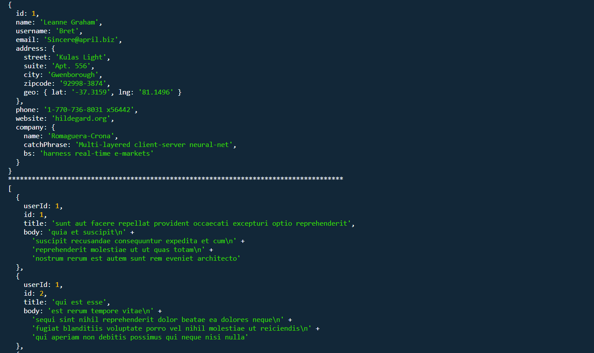

# Getting Data from Fake API
## [Patika.dev](https://app.patika.dev) React Course First Homework

### What is this?
In this homework we used JavaScript and Node to create [a basic module](my-module.js) and import it to our [main JavaScrip file](app.js). Then we got data from [https://jsonplaceholder.typicode.com/](https://jsonplaceholder.typicode.com/) according to an user ID and logged it in the console. It is not made with React but it's made for creating a base for it.

### Screnshot

    

